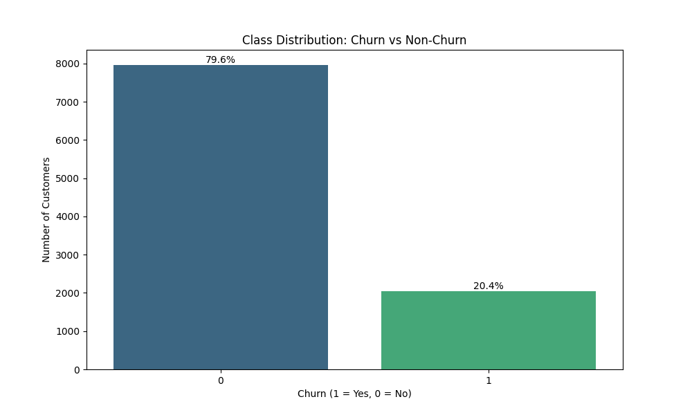

# Bank Customer Churn Prediction

A machine learning project to predict which bank customers are likely to leave (churn) using XGBoost and ensemble techniques.

## Overview

This project implements an end-to-end machine learning pipeline for bank customer churn prediction:

- **Data**: 10,000 customer records with demographics and banking details
- **Models**: XGBoost, LightGBM, Random Forest, Neural Network, and Stacking Ensemble
- **Best Model**: XGBoost with threshold optimization (F1 Score: 0.628)
- **Features**: Advanced feature engineering including financial ratios, engagement scores, and more

## Results

The model evaluation showed that an optimized XGBoost model performed best:

### Key Metrics of Best Model (XGBoost with threshold = 0.4):
- **Precision**: 59.8% (60% of predicted churners actually churned)
- **Recall**: 66.1% (66% of actual churners were correctly identified)
- **F1 Score**: 62.8%
- **ROC AUC**: 85.9%

## Data Exploration

The dataset contained 20.37% churned customers, showing a class imbalance.


## Usage

### Running the Full Pipeline

```python
from src.bank_churn_predictor import BankChurnPredictor

# Run full pipeline
predictor = BankChurnPredictor(file_path="data/Bank Customer Churn Prediction.csv")
predictor.run_full_pipeline()
```

### Making Predictions with the Saved Model

```python
from src.bank_churn_predictor import BankChurnPredictor
import pandas as pd

# Load the saved model
predictor = BankChurnPredictor()
predictor.load_model("models/best_churn_model.joblib")

# Load new customer data (must have same columns as original data)
new_customers = pd.read_csv("new_customers.csv")

# Get predictions
predictions, probabilities = predictor.predict(new_customers)

# Add to dataframe
new_customers['churn_probability'] = probabilities
new_customers['predicted_churn'] = predictions

# Identify high-risk customers
high_risk = new_customers[new_customers['churn_probability'] > 0.6]
```

## Business Recommendations

Based on the model insights, we recommend the following actions to reduce customer churn:

1. Focus on customers with high balance but low activity
2. Proactively engage with customers who have multiple products but low usage
3. Create targeted retention campaigns for specific demographic segments
4. Implement an early warning system to identify potential churners

## Requirements

- Python 3.8+
- scikit-learn >= 1.0.0
- xgboost >= 1.5.0
- lightgbm >= 3.3.0
- pandas >= 1.3.0
- numpy >= 1.20.0
- matplotlib >= 3.4.0
- seaborn >= 0.11.0
- imbalanced-learn >= 0.8.0

## Installation

```bash
# Clone this repository
git clone https://github.com/YOUR_USERNAME/bank-customer-churn-prediction.git

# Navigate to the project directory
cd bank-customer-churn-prediction

# Install dependencies
pip install -r requirements.txt
```

## License

This project is licensed under the MIT License.
